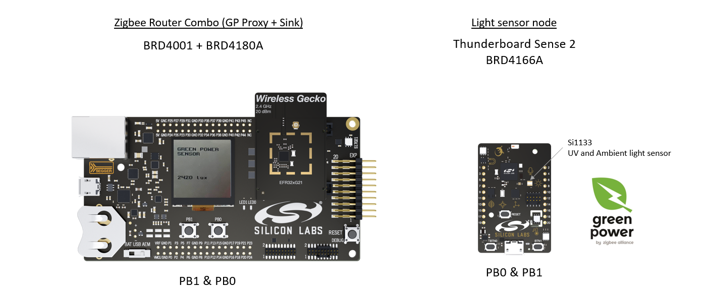

# Zigbee Combo Router with SINK for the light sensor

This repository holds documentation and implementation on how to create a Zigbee Combo Router with SINK for the ZGP light sensor example  

In order to proceed, you will need to download EmberZNet SDK through Simplicity Studio
The SDK's access can only be requested using the serial number coming from this development kit :
[SLWSTK6000B](https://www.silabs.com/development-tools/wireless/zigbee/efr32mg-zigbee-thread-starter-kit)

At the time of writing, this is done using Simplicity Studio v5 and GSDK 3.1.0



## Description ##
This code is running on a SLWRB4180A and uses the display of its SLWMB4001 mother board to show Light sensor measurement.
It can be commissioned to any Zigbee 3.0 network or can form one for the demo.  

To pair and use it, follow the steps described in the section *"Running the example"*

## Documentation ##

Official Zigbee SDK documentation can be found at our [Developer Documentation](https://docs.silabs.com/zigbee/latest/) page.

Zigbee Green Power:
  - [UG392](https://www.google.com/url?sa=t&rct=j&q=&esrc=s&source=web&cd=&cad=rja&uact=8&ved=2ahUKEwiW8ujrhIruAhVOrxoKHXD-B4wQFjAAegQIBRAC&url=https%3A%2F%2Fwww.silabs.com%2Fdocuments%2Fpublic%2Fuser-guides%2Fug392-using-sl-green-power-with-ezp.pdf&usg=AOvVaw1z-XzjI55_ExlDnChtSArt)
  - [Zigbee pro green power feature](https://zigbeealliance.org/wp-content/uploads/2019/11/docs-09-5499-26-batt-zigbee-green-power-specification.pdf)

Zigbee:
  - [Zigbee Cluster Library](https://zigbeealliance.org/wp-content/uploads/2019/12/07-5123-06-zigbee-cluster-library-specification.pdf)

Display support:
  - [Glib Library](https://docs.silabs.com/gecko-platform/latest/middleware/api/group-glib)

## Disclaimer ##

The Gecko SDK suite supports development with Silicon Labs IoT SoC and module devices. Unless otherwise specified in the specific directory, all examples are considered to be EXPERIMENTAL QUALITY which implies that the code provided in the repos has not been formally tested and is provided as-is.  It is not suitable for production environments.  In addition, this code will not be maintained and there may be no bug maintenance planned for these resources. Silicon Labs may update projects from time to time.
