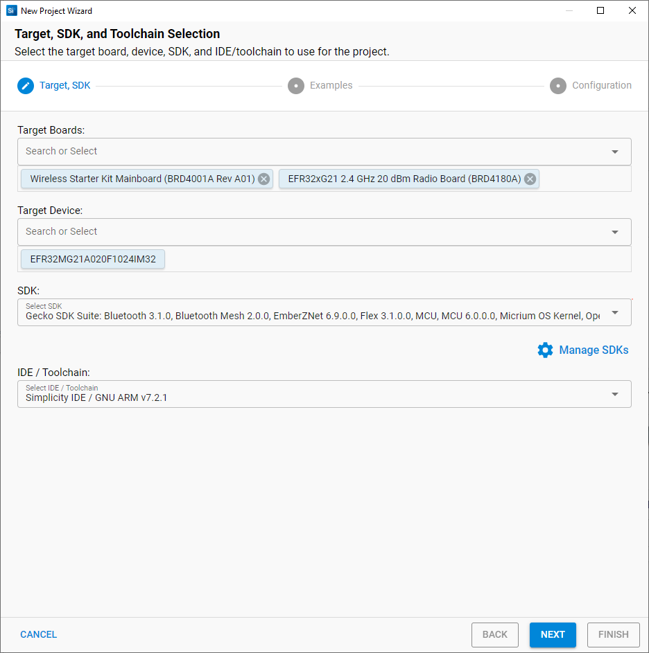
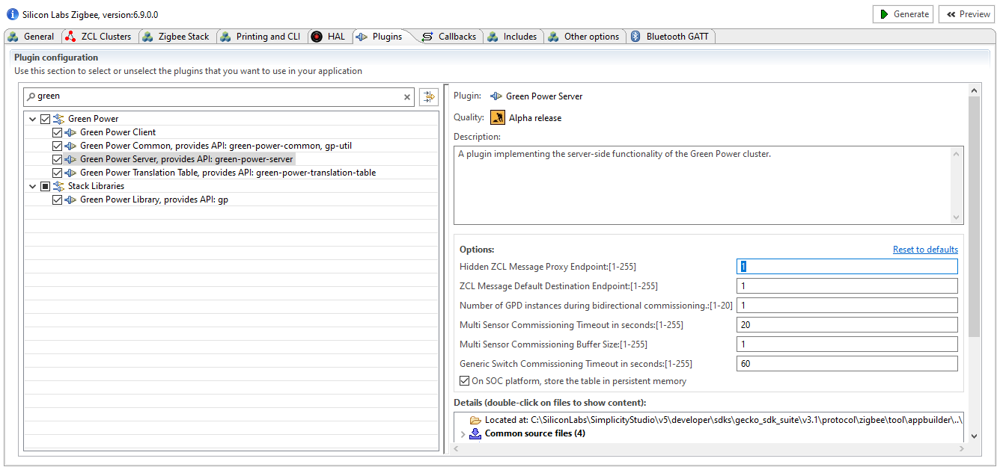

# Create and Configure the new project

## Create the project:

Lets start our project from one of the example by clicking on "create New Project" button and select the BRD4180A (EFR32MG21A) Hardware as your target.

-	Create a new Zigbee 3.0 project

-	Select "Z3_LightGPCombo" Sample Application and name it for example "Z3_LightGPCombo_gpdisplay"

## Configure the project:

Select the ISC file to start the configuration.

- In the “Plugins” tab, select "green Power Sever" and change its "Hidden ZCL Message Proxy Endpoint" to 1 if it was otherwise. This is to solve a problem with the project generating with wrong endpoint. This should be solved in next version.

-	Because we want to be able to commission and get measurements for a light sensor, in the “Clusters” tab, we will need to modify the ZCL device type for endpoint 1. To do this select the endpoint, then select "Zigbee Custom" in the ZCL device type list. Then select "LO devices" --> "LO Dimmable Light" as your base for the custom cluster as this was the one used in the project before we add our sensor support. This way, all the existing functionalities of the Combo project we start from will be kept (i.e. we will still be able to commission a switch to the node and control its LED).

then go to the Measurement & Sensing Clusters to add "Illuminance Measurement". Without this the application would not be able to commission the Green Power sensor and get its measurement values.

-	Because we created the custom ZCL device cluster in the previous step, we need to ensure all the Network Creator plugins are still in the project. Those are necessary to form the network if the router is not entering an existing network.

- Now, we would like to take advantage of the display available on the wireless kit, we will need to add in the "Plugins" tab:
  - graphics library (glib)
  - wstk display drivers

  

- As we have integrated the display software support libraries, we need also to enable it and configure it at its hardware point of view. This is done in the HAL tab by opening the hardware configurator. Once the hardware configurator view is opened:
  - select the "DefaultMode Peripheral" tab
  - check "SPI Display" in the HAL section
  - USART2 is automatically selected and linked to the display.

  

      

## Generate the project:

At this point we can click on Generate button to finish to create the project and focus on the code implementations.

 
