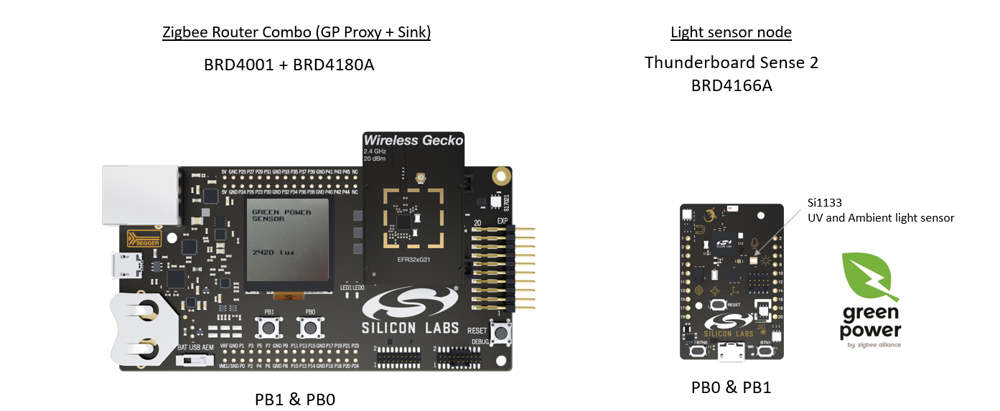
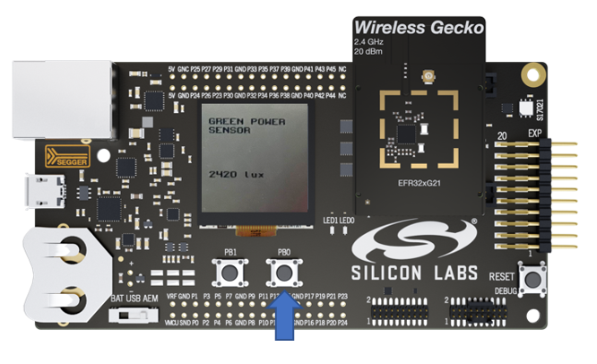

# Running the example



## Setup up the boards and utilities

 - Power up the 2 boards.
 - You can open a terminal for both boards. Settings are the usual 115200,8,N,1 et it is good to add local echo.
 - press reset buttons on both boards
 - look at the terminal on the Grren power device. you should get a print as follow:

 ```
 GPD main
 lux : 2243
  ```
  - on wstk side the terminal is waiting for an entry on you side. press ENTER on your keyboard and you should get this prompt:

  ```
  Z3LightGPComboSoc_gpdisplay>
  ```

you are ready for the next step!

## Commission the Green Power node (Thunderboard Sense 2)

To follow the steps and exchanges in that demo, you can open a terminal for both boards. Settings are the usual 115200,8,N,1 et it is good to add local echo.
As you power up the 2 boards, the router will scan for existing open networks to join and if none will form one in distributed security mode.
You can check this with the "info" command. The following response will show you the node configuration. This node has a panID therefore it is integrated to a network.

```
Z3LightGPComboSoc_gpdisplay>info

MFG String:
AppBuilder MFG Code: 0x1002
node [(>)000D6FFFFE0A48B7] chan [25] pwr [3]
panID [0xB411] nodeID [0xAE21] xpan [0x(>)158FF3CDD2589D4B]
parentID [0xFFFF] parentRssi [0]
stack ver. [6.9.0 GA build 178]
nodeType [0x02]
Security level [05]
network state [02] Buffs: 75 / 75
Ep cnt: 2
ep 1 [endpoint enabled, device enabled] nwk [0] profile [0x0104] devId [0x0101] ver [0x01]
    in (server) cluster: 0x0000 (Basic)
    in (server) cluster: 0x0003 (Identify)
    in (server) cluster: 0x0004 (Groups)
    in (server) cluster: 0x0005 (Scenes)
    in (server) cluster: 0x0006 (On/off)
    in (server) cluster: 0x0008 (Level Control)
    out(client) cluster: 0x0400 (Illuminance Measurement)
    out(client) cluster: 0x0402 (Temperature Measurement)
    out(client) cluster: 0x0406 (Occupancy Sensing)

ep 242 [endpoint enabled, device enabled] nwk [0] profile [0xA1E0] devId [0x0066] ver [0x01]
    out(client) cluster: 0x0021 (Green Power)
    in (server) cluster: 0x0021 (Green Power)

Nwk cnt: 1
nwk 0 [Primary (pro)]
  nodeType [0x02]
  securityProfile [0x05]

```

Now it is time to open green power commissioning by pressing PB0 on the router.



You should get a message like the following on the terminal:

```
T00000000:RX len 6, ep F2, clus 0x0021 (Green Power) FC 19 seq 03 cmd 02 payload[03 FF 00 ]

Enter comm for sink 62FF
```
an alternative method is to use the CLI and enter the following command:

```
plugin green-power-server commission 9 0 0 1
```

This will open the Light for joining with your GPD. The parameters are:

    Mode Mask 0x0 Leave, 0x1 Commission, 0x8 Proxies
    --> tells the light to enter commissioning mode by itself and also to Broadcast to all devices telling them to be ready to open and find a GP device.

    Green Power Manager (GPM) address for security

    Green Power Manager (GPM) address for pairing

    Sink endpoint


We now move on the Thunderboard and press PB0 4 times waiting at least second between each press


for example:
  - Press once … wait 1+ second
  - Press twice … wait 1+ second
  - Press a third time … wait 1+ second
  - Press a fourth time … done

Each of these button presses are the following steps:
  -  Press 1 – Channel request: To find the channel of the Zigbee network and use use that for commissioning requests
  -  Press 2 – Commissioning command: Commissioning request
  -  Press 3 – Commissioning command: To collect the commissioning reply
  - Press 4 – Commissioning command: To indicate the successful commissioning


On the CLI of Zigbee Combo device, look for an output that looks like the following:

```  
GP CN : Saving the GPD Calling Adding TT and Sink
gpdCommandClusterEpMap[0].gpdCommand = 32
gpdCommandClusterEpMap[0].endpoints[0] = 1
gpdCommandClusterEpMap[1].gpdCommand = 33
gpdCommandClusterEpMap[1].endpoints[0] = 1
gpdCommandClusterEpMap[2].gpdCommand = 34
gpdCommandClusterEpMap[2].endpoints[0] = 1
SinkCommissioningModeCallback(Exit) send returned 0
.
.
.
Device Announce: 0x5678
```    
What you really want to see is the device announce.
This output means that your GPD has paired and your router has made entries for it in its tables.
You can test this by pressing PB1 on the Thunderboard, it should triggers the display of the LUX level on the router LCD.
If you do not see this or PB1 does not triggers the measurement, try pressing the reset button on the Zigbee combo device.
