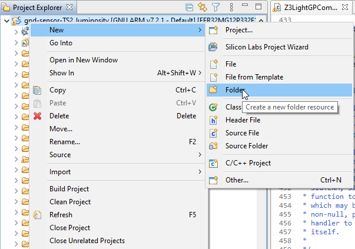
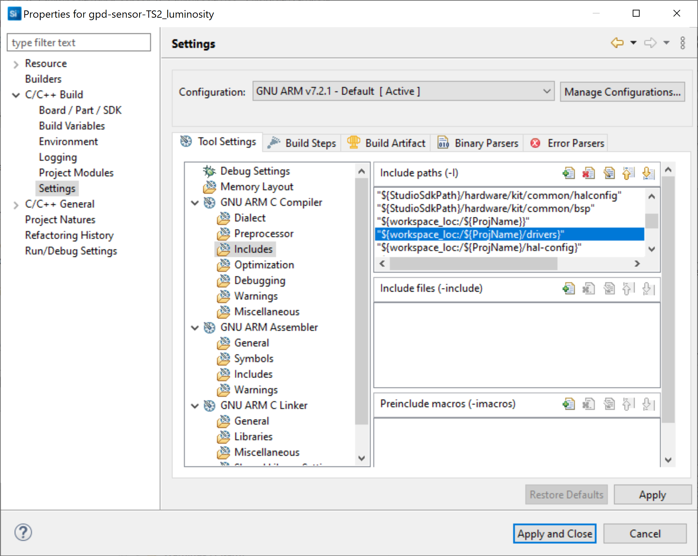
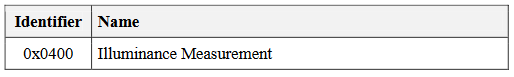
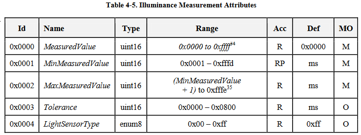
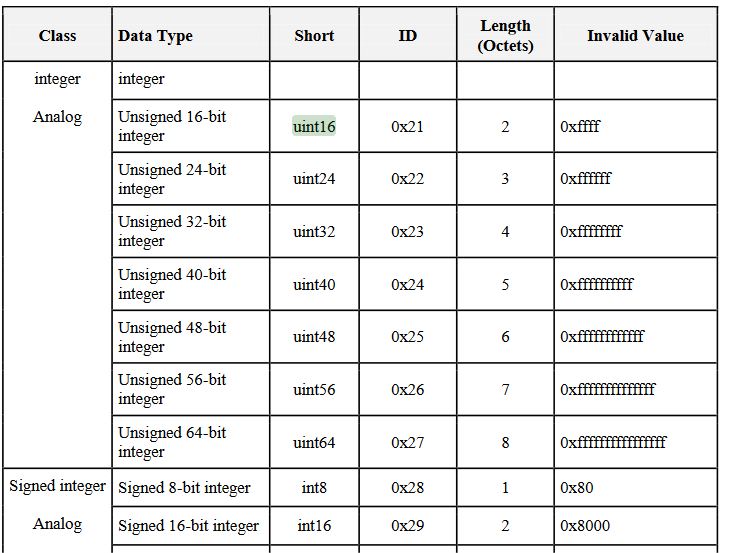

# Modify the callbacks to integrate your application

## Add necessary files/drivers to the project:

- to support Si1133 UV and Ambient light sensor we need to add several files into the project.

  We will first create a directory named "drivers" in our project by right clicking on the project name in the Project Explorer.



  Then copy there the following files from the SDK:
  C:\SiliconLabs\SimplicityStudio\v5\developer\sdks\gecko_sdk_suite\v3.1\hardware\kit\common\bsp\thunderboard

  - Si1133.c and Si1133.h  (Si1133 driver functions)  
  - board_4166.c and board_4166.h  (Thunderboard Sense 2 driver functions)
  - utils.c and utils.h (utilities functions used by the above files)

- Because Si1133 is an I2C device we will also add I2CSPM drivers from:
  C:\SiliconLabs\SimplicityStudio\v5\developer\sdks\gecko_sdk_suite\v3.1\hardware\kit\common\drivers
  . i2cspm.c and i2cspm.h

- We also need to add this directory to the project 'C' path to have it taken into account.

```c
"${workspace_loc:/${ProjName}/drivers}"
```

You can do this by right clicking on the project name in the Project explorer and selecting "properties" or by going to "File" menu and selecting "properties".

Then add the line above into the "GNU ARM C Compiler" --> "Includes" --> "Include Paths" list  with its "+" button above the list. This is shown below.



- in the same way we need to add the Thunderboard Sense 2 (BRD4166A) configuration files support path:

```c
"${StudioSdkPath}/hardware/kit/EFR32MG12_BRD4166A/config"
```

## Modify the default callback file with our code:

- Open the file gpd-sensor-callbacks.c. This is the implementation for the default sensor.

- now we will add the necessary includes and definitions for the Si1133 support on top of gpd-sensor-callbacks.c, just after the #include already present in the base example:

```c
#include "em_i2c.h"
#include "i2cspm.h"
#include "si1133.h"
#include "util.h"
#include "em_gpio.h"

#define SI1133_I2C_BUS_TIMEOUT          (1000)
#define SI1133_I2C_DEVICE_BUS_ADDRESS   (0xAA)
#define SI1133_I2C_DEVICE               (I2C1)

// BRD4166A settings
#define I2CSPM_INIT_DEFAULT                                                   \
  { SI1133_I2C_DEVICE,                      /* Use I2C instance 0                       */ \
    gpioPortC,                 /* SCL port                                 */ \
    5,                        /* SCL pin                                  */ \
    gpioPortC,                 /* SDA port                                 */ \
    4,                        /* SDA pin                                  */ \
    17,                        /* Port location of SCL signal              */ \
    17,                        /* Port location of SDA signal              */ \
    0,                         /* Use currently configured reference clock */ \
    I2C_FREQ_STANDARD_MAX,     /* Set to standard rate                     */ \
    i2cClockHLRStandard,       /* Set to use 4:4 low/high duty cycle       */ \
  }

static I2CSPM_Init_TypeDef i2cInit = I2CSPM_INIT_DEFAULT;

#define I2CSPM_TRANSFER_TIMEOUT 300000
uint32_t si1133_status;
/** This flag indicates that a new measurement shall be done. */
static volatile bool measurement_flag = true;
uint8_t irqStatus = 0;
uint8_t state;
float   lux = 0;
float   uv = 0;
uint8_t  uvIndex = 0;
uint16_t ambLight = 0;
```

- we will now add the necessary initialization calls in the emberGpdAfPluginMainCallback() function which is the main function for the GPD plugin.

```c
void emberGpdAfPluginMainCallback(EmberGpd_t * gpd)
{
UTIL_init();
// I2C init for SI1133 luminosity measurement
GPIO_PinModeSet(gpioPortF, 9, gpioModePushPull, 1);   //enable sensor VDD
I2CSPM_Init(&i2cInit);

si1133_status = SI1133_init();
```

- we will now create a new function to perform the ambient light measurement. You can add this before first function in the file.

```c
void perform_measurement(void)
{
  /* Start an ALS measurement */
    si1133_status = SI1133_measurementForce();
    measurement_flag = true;
    /* Check if the conversion finished on all channels */
    si1133_status = SI1133_getIrqStatus(&irqStatus);
    while (irqStatus != 0x0F)
      si1133_status = SI1133_getIrqStatus(&irqStatus);
    measurement_flag = false;
    si1133_status= SI1133_getMeasurement(&lux, &uv);
    ambLight = (uint16_t) (lux * 100);
    uvIndex = (uint8_t)uv;
}
```

- we will call this function 2 times in the code:

  - in emberGpdAfPluginMainCallback (the function called after boot) so that if the node is already commissioned to a network and working from energy harvesting, measurement can be done as quickly as possible to immediately issue a report before lacking energy.

  Following code should be placed just before the   "while (initStatus != SL_STATUS_OK) ;" line (which should be close to line number 555).

  It calls the the measurement function then tells the stack a report should be sent with the results.

  ```c
  perform_measurement();


  if (gpd->gpdState >= EMBER_GPD_APP_STATE_OPERATIONAL)
     appAction = APP_EVENT_ACTION_SEND_REPORT;
   measurement_flag = true;

  ```

  - in the regular timer started after node is commissioned to report measurement at a preprogrammed pace.

  modify reportTimeCallback() like this:

  ```c
  static void reportTimeCallback(sl_sleeptimer_timer_handle_t *handle, void *contextData)
   {
    EmberGpd_t * gpd = emberGpdGetGpd();
    if (gpd->gpdState >= EMBER_GPD_APP_STATE_OPERATIONAL) {
      perform_measurement();
      appAction = APP_EVENT_ACTION_SEND_REPORT;
    } else {
      sl_sleeptimer_stop_timer(handle);
    }
  }
  ```

- now we will adapt the default report frame payload to indicate content is coming from a light sensor. This is done in the sendReport() function.
  command gets the GP_CMD-ATTRIBUTE_REPORTING from the light sensor ID modifications we have done during the project creation (0x11).
  following data in the command array are:

   - target ZCL cluster --> 0x0400 for Illuminance measurements (little Endian coding --> 0x00 0x04)

  

   - Attribute Id for the illuminance measaurement Id is 0x0000 ( same in little Endian!)

   

   - Attribute type coding is unsigned int16  therefore 0x21

   

   - finally the Ambient light measurement in little Endian coded bytes.

   ```c
   static void sendReport(EmberGpd_t * gpd)
   {
    gpdDebugPrintf("lux: %d\n", ambLight);
    uint8_t command[] = {
              GP_CMD_ATTRIBUTE_REPORTING,
              0x00, 0x04, // ZCL Cluster Id Illuminance measurement
              0x00, 0x00, // Attribute Id measured value unsigned int16
              0x21,       // Attribute Type A- Table 2-10 unsigned 16bits
              ambLight,ambLight>>8    // Attribute Value LSB byte first as per Zigbee rule
            };
    gpd->rxAfterTx = false;
    emberAfGpdfSend(EMBER_GPD_NWK_FC_FRAME_TYPE_DATA,
                            gpd,
                            command,
                            sizeof(command),
                            EMBER_AF_PLUGIN_APPS_CMD_RESEND_NUMBER);
    measurement_flag = false;
   }
   ```

- Optionally and very last modification to the code will be to modify the way commissioning will be operated. in halButtonIsr() we will modify the code to call emberGpdAppSingleEventCommission(); function instead of using the 4 button press process which is default to the example.
code end up like following:

```c
void halButtonIsr(uint8_t button, uint8_t state)
{
  uint8_t botton0State = halButtonState(BSP_BUTTON0_PIN);
  uint8_t botton1State = halButtonState(BSP_BUTTON1_PIN);
  if (botton0State == BUTTON_PRESSED && botton1State == BUTTON_PRESSED) {
    appAction = APP_EVENT_ACTION_SEND_DECOMMISSION;
  } else if (botton0State == BUTTON_PRESSED) {
//    appAction = APP_EVENT_ACTION_SEND_COMMISSION;
      emberGpdAppSingleEventCommission();
  } else if (botton1State == BUTTON_PRESSED) {
    appAction = APP_EVENT_ACTION_SEND_REPORT;
  }
}
```

## Compile time:

Build and flash the generated binary (be sure to have flashed a bootloader as well!).

Bootloader can be generated from the Gecko bootloader examples, but if you want to shortcut for this tutorial, you can flash any of the demos before flashing this project's binary. Just avoid erasing the memory as this may erase the bootloader as well.
