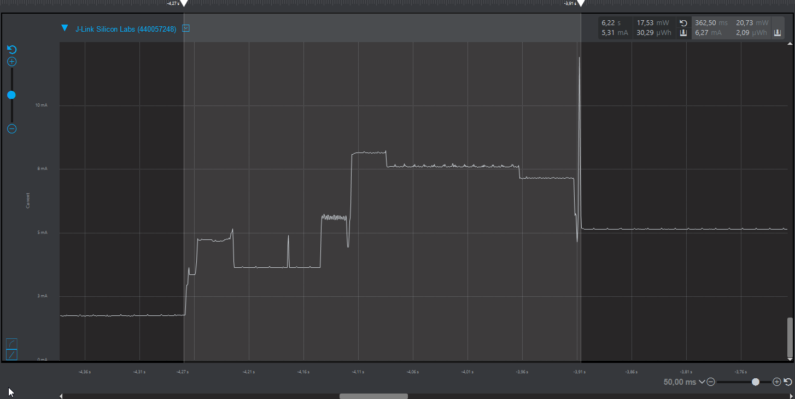

# Running the example

## Setup, commission and application behavior

The full process is provided within the similar page in Zigbee light + GP sensor sink project available on this [link](../ZCR_light_sensor_sink/running_application.html)

Indeed this Green Power sensor requires a network to get connected and deliver its data. The network is created by the Zigbee combo node described in the other tutorial at this [link](../ZCR_light_sensor_sink/README.md).

We use then its display to show the light sensor measurement values sent by the green power node we just created.

## Current measurements

Here's a good information if you want to use energy harvesting to supply the green power sensor node.

Once commissioned (more energy is needed for that unique in time sequence), the node can be switched off due to lack of energy without loosing its connection to the network.

If at least 7.4mJ (@3.3V) of energy is harvested it will enable to wake up the node for 370ms and provide the 20mW@3.3V it requires to boot, initialize zigbee, perform a light measurement and transmit its green power packet at least once.

Below is a capture from the POR to the end of the transmission (short current peak at the end).

